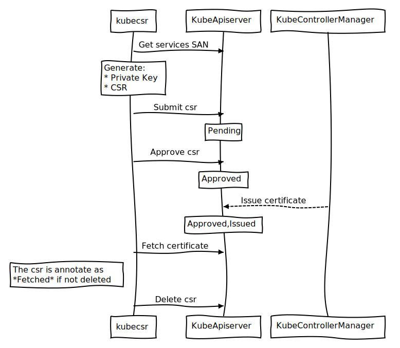

# Kubernetes Certificate Signing Request 

[](https://circleci.com/gh/JulienBalestra/kube-csr) [](https://travis-ci.org/JulienBalestra/kube-csr) [](https://goreportcard.com/report/github.com/JulienBalestra/kube-csr) [](https://quay.io/repository/julienbalestra/kube-csr)

## Table of Contents
- [Issue](#issue)
- [Garbage Collector](#garbage-collector---gc)
- [Demo](#demo)
- [Container image](#container-image)
- [Command line](#command-line)
    * [InCluster](#in-cluster)
- [Library](#library)
- [Features Enhancement](#features---enhancement)

## Issue

All in one:
* query Kubernetes service to get potential subject alternative name (SAN)
    * ClusterIP
    * ExternalIPs
    * LoadBalancerIP
    * ExternalName
* generate
    * Private Key - **stay on disk**
    * Certificate Signing Request (CSR)
* submit the generated CSR
* approve the submitted CSR
* fetch the generated certificate
* delete the kubernetes csr resource


But you can also choose to select the steps you want to execute.

For example, you can do the following actions:
* generate the PK, CSR
* submit the generated CSR
* <s>approve the submitted CSR</s>
* fetch the generated **externally approved** certificate
* <s>delete the kubernetes csr resource</s>



## Garbage collector - gc

Delete any Kubernetes csr resources who meets the chosen requirements:

* After the grace period
    * Annotated as fetched
    * Denied

The garbage collector can be daemonized with the adapted flags.

When daemonised, it exposes a prometheus endpoint with the associated [metrics](./docs/metrics.csv) and a [pprof](https://golang.org/pkg/net/http/pprof/) endpoint.

## Demo

[](https://asciinema.org/a/uIh0ujCiRiWJ6NOyLcEf369vq)

## Container image

Available at `quay.io/julienbalestra/kube-csr:latest`

The tag `latest` is up to date with master.

Please, have a look to the [release  page](https://github.com/JulienBalestra/kube-csr/releases) to get a more stable image tag.

## Command line

Command line example:
```text
$ ./kube-csr issue etcd --generate --submit --approve --fetch --subject-alternative-names 192.168.1.1,example.com --kubeconfig-path ~/.kube/config

I0610 21:07:49.737337    5259 generate.go:59] Added IP address 192.168.1.1
I0610 21:07:49.737541    5259 generate.go:64] Added DNS name example.com
I0610 21:07:49.737547    5259 generate.go:73] CSR with 1 DNS names and 1 IP addresses
I0610 21:07:49.737553    5259 generate.go:94] Generating CSR with CN=etcd
I0610 21:07:49.740107    5259 write.go:57] Wrote RSA PRIVATE KEY to /home/jb/go/src/github.com/JulienBalestra/kube-csr/kube-csr.private_key
I0610 21:07:49.740142    5259 write.go:57] Wrote CERTIFICATE REQUEST to /home/jb/go/src/github.com/JulienBalestra/kube-csr/kube-csr.csr
I0610 21:07:49.750902    5259 submit.go:93] Successfully created csr/etcd-haf uid: 9163ed79-6ce1-11e8-a2ef-5404a66983a9
I0610 21:07:49.750932    5259 approve.go:38] Approving csr/etcd-haf ...
I0610 21:07:49.753173    5259 approve.go:49] csr/etcd-haf is approved
I0610 21:07:49.753192    5259 fetch.go:97] Start polling for certificate of csr/etcd-haf, every 1s, timeout after 10s
I0610 21:07:50.759603    5259 fetch.go:128] Certificate successfully fetched, writing 1200 chars to /home/jb/go/src/github.com/JulienBalestra/kube-csr/kube-csr.certificate
```

The `--override` flag allows to delete and re-submit an already submitted CSR.

To get the following files:
```text
kube-csr.certificate kube-csr.csr kube-csr.private_key
```

```text
$ openssl x509 -in kube-csr.certificate -text -noout

Certificate:
        Issuer: CN = p8s
        Subject: CN = etcd
            X509v3 Subject Alternative Name: 
                DNS:etcd-0.default.svc.cluster.local, IP Address:192.168.1.1
```

Observe in the controller-manager logs:
```text
$ kubectl logs po/kube-controller-manager -n kube-system

[INFO] signed certificate with serial number [...]
```

Have a look the the command line documentation [here](docs/kube-csr.md)

### In cluster

The current Kubernetes setup is deployed with [pupernetes](https://github.com/DataDog/pupernetes)
In this example, the all in one [etcd example](examples/etcd.yaml) is used.

Current cluster:
```text
$ kubectl get svc,deploy,ds,po --all-namespaces

NAMESPACE     NAME         TYPE        CLUSTER-IP      EXTERNAL-IP   PORT(S)         AGE
default       kubernetes   ClusterIP   192.168.254.1   <none>        443/TCP         1m
kube-system   coredns      ClusterIP   192.168.254.2   <none>        53/UDP,53/TCP   1m

NAMESPACE     NAME      DESIRED   CURRENT   UP-TO-DATE   AVAILABLE   AGE
kube-system   coredns   1         1         1            1           1m

NAMESPACE     NAME             DESIRED   CURRENT   READY     UP-TO-DATE   AVAILABLE   NODE SELECTOR   AGE
kube-system   kube-proxy       1         1         1         1            1           <none>          1m
kube-system   kube-scheduler   1         1         1         1            1           <none>          1m

NAMESPACE     NAME                       READY     STATUS    RESTARTS   AGE
kube-system   coredns-747dbcf5df-zllhm   1/1       Running   0          1m
kube-system   kube-controller-manager    1/1       Running   0          1m
kube-system   kube-proxy-2z9vw           1/1       Running   0          1m
kube-system   kube-scheduler-v8lwc       1/1       Running   0          1m
``` 

Apply the manifests:
```text
$ kubectl apply -f examples/etcd.yaml 

serviceaccount "etcd" created
clusterrole.rbac.authorization.k8s.io "system:etcd" created
clusterrolebinding.rbac.authorization.k8s.io "system:etcd" created
statefulset.apps "etcd" created
job.batch "etcdctl" created
service "etcd" created
```

Produce:
```text
$ kubectl get csr,po --show-all

NAME                                              AGE       REQUESTOR                            CONDITION
csr/etcd-0-140d1b66-6ce3-11e8-a2ef-5404a66983a9   1m        system:serviceaccount:default:etcd   Approved,Issued
csr/etcd-1-173e7ddd-6ce3-11e8-a2ef-5404a66983a9   1m        system:serviceaccount:default:etcd   Approved,Issued
csr/etcd-2-1a6a22a1-6ce3-11e8-a2ef-5404a66983a9   59s       system:serviceaccount:default:etcd   Approved,Issued

NAME        READY     STATUS    RESTARTS   AGE
po/etcd-0   1/1       Running   0          1m
po/etcd-1   1/1       Running   0          1m
po/etcd-2   1/1       Running   0          1m
```

Observe the logs of the init container kube-csr:
```text
$ kubectl logs etcd-0 kube-csr

I0610 19:18:39.760447       1 generate.go:59] Added IP address 172.17.0.2
I0610 19:18:39.760763       1 generate.go:64] Added DNS name etcd-0.etcd.default.svc.cluster.local
I0610 19:18:39.760768       1 generate.go:64] Added DNS name etcd.default.svc.cluster.local
I0610 19:18:39.760772       1 generate.go:73] CSR with 2 DNS names and 1 IP addresses
I0610 19:18:39.760776       1 generate.go:94] Generating CSR with CN=etcd-0
I0610 19:18:39.765065       1 write.go:57] Wrote RSA PRIVATE KEY to /etc/certs/etcd.private_key
I0610 19:18:39.765174       1 write.go:57] Wrote CERTIFICATE REQUEST to /etc/certs/etcd.csr
I0610 19:18:39.774289       1 submit.go:93] Successfully created csr/etcd-0-140d1b66-6ce3-11e8-a2ef-5404a66983a9 uid: 14d5bba8-6ce3-11e8-a2ef-5404a66983a9
I0610 19:18:39.774306       1 approve.go:38] Approving csr/etcd-0-140d1b66-6ce3-11e8-a2ef-5404a66983a9 ...
I0610 19:18:39.838744       1 approve.go:49] csr/etcd-0-140d1b66-6ce3-11e8-a2ef-5404a66983a9 is approved
I0610 19:18:39.838774       1 fetch.go:97] Start polling for certificate of csr/etcd-0-140d1b66-6ce3-11e8-a2ef-5404a66983a9, every 1s, timeout after 10s
I0610 19:18:40.841823       1 fetch.go:127] Certificate successfully fetched, writing 1281 chars to /etc/certs/etcd.certificate
```

See the output of the completed Job:
```text
$ kubectl logs etcdctl-${ID}

[...]
member 6c254b8f2d60eb6a is healthy: got healthy result from https://etcd-2.etcd.default.svc.cluster.local:2379
member 6ca04f5d282b7cd5 is healthy: got healthy result from https://etcd-0.etcd.default.svc.cluster.local:2379
member 891a4cb0531d4224 is healthy: got healthy result from https://etcd-1.etcd.default.svc.cluster.local:2379
cluster is healthy
```

## Library

Please see an example to use **kube-csr** as library [here](examples/issue.go)

```bash
go get github.com/JulienBalestra/kube-csr/pkg/operation/...
```

## Features - Enhancement

Please, create an issue !
